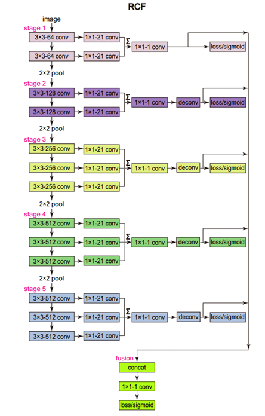
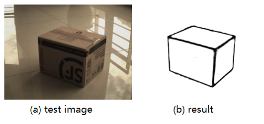

# box_edge_detection

box edge detection using RCF[1]

VGG-16 as backbone, every convolution stage as an output to predict the box edge.

network:

example：

[1]: https://arxiv.org/abs/1612.02103v2Richer "Convolutional Features for Edge Detection"
